[TOC]

# LangChain相关地址

------

- **官网**：https://www.langchain.com/
- **GitHub 地址**：https://github.com/langchain-ai
- **中文文档地址**：https://docs.langchain.org.cn/oss/python/langchain/overview
- **英文文档地址**：https://docs.langchain.com/oss/python/langchain/overview
- **API 文档查询地址**：https://reference.langchain.com/python/langchain/


# 为什么需要LangChain

------

## 单一的大模型的局限性

------


- 知识受限于旧数据
- 无法和外部系统交互（API 数据库等）
- 不具备保持状态的能力


## LangChain的定位

------

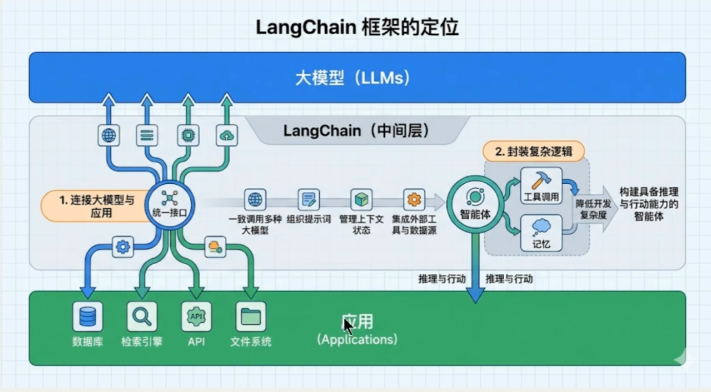


安装相关依赖：

✅ 优先conda install 然后pip install

```shell
conda install langchain=1.2.12
## 从特定渠道下载依赖 上面默认的下载会找不到
conda install -c conda-forge langchain==1.2.12
## 用pip装 conda要求严格 上面的会有版本错误
pip install langchain==1.2.12
```


安装所有的依赖：

[📎requirements.txt](https://www.yuque.com/attachments/yuque/0/2026/txt/29329670/1788404437850-1bf62148-3101-4121-9ad0-83a6711d2f1e.txt)

⚠️ 要切换到对应的环境

```shell
conda activate langchain1.2
pip install -r ./requirements.txt
```


# 大模型应用场景

------

## RAG（检索生成增强）

------


## Agent开发

------

✅ 利用LLM的推理决策能力，通过规划、记忆和工具调用的能力，构造一个能独立思考，逐步完成给定目标的Agent（智能体）。

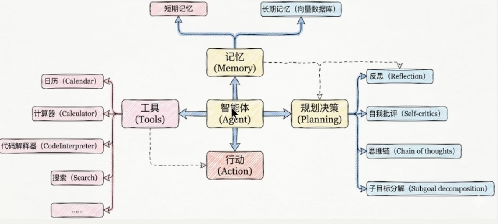


## 大模型应用开发的4个场景

------

纯Prompt

✅ 问一句答一句

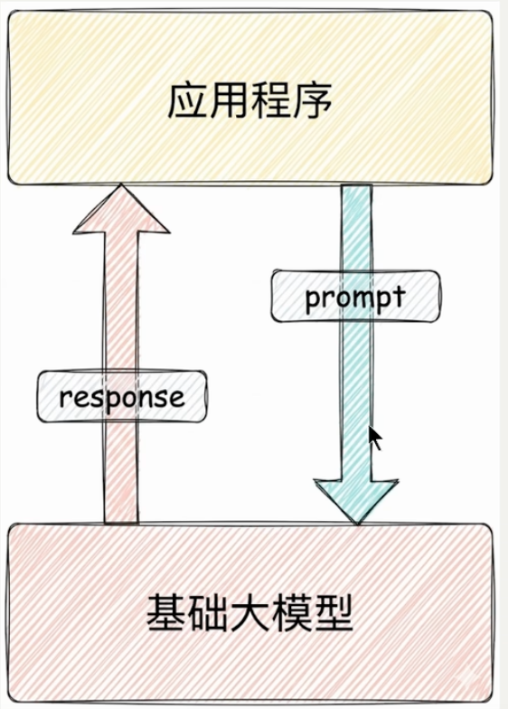


Agent + Function Calling

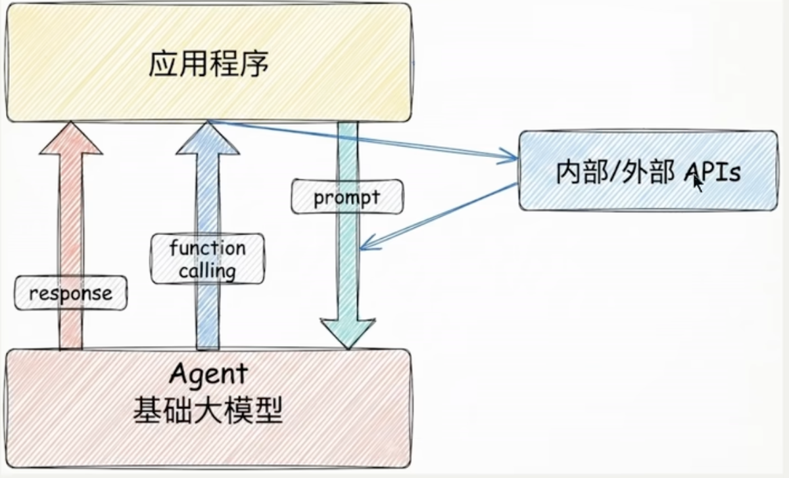


RAG（检索生成增强）

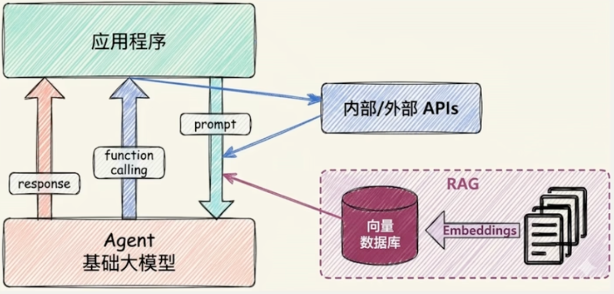


Fine-tuning（精调\微调）

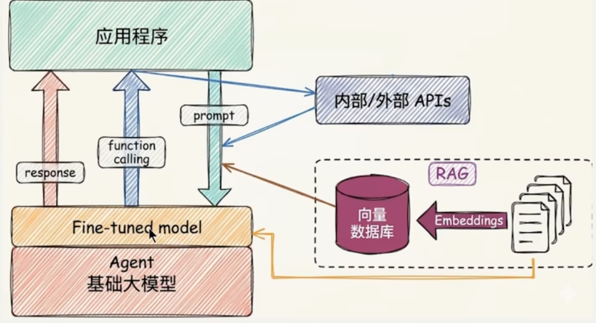


技术选型路线

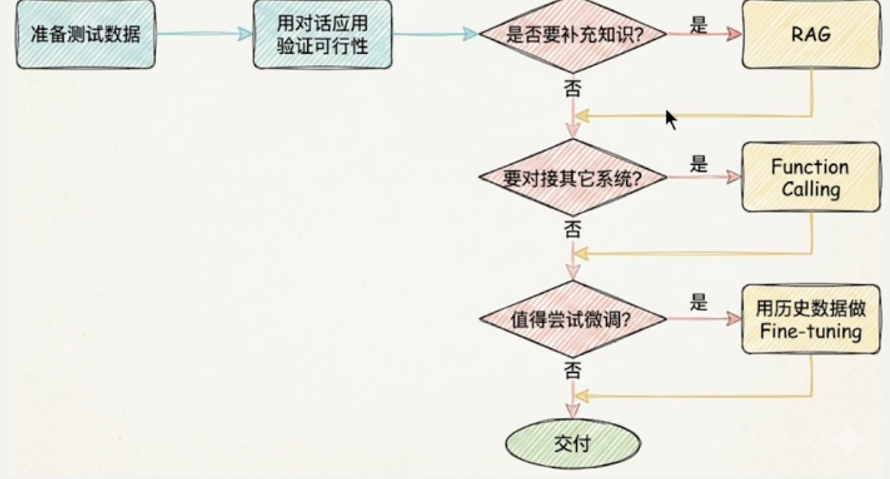


# 模型初始化

------


## 在线模型

------

deepseek


1. 安装依赖（前面已经靠txt文件初始化了）
   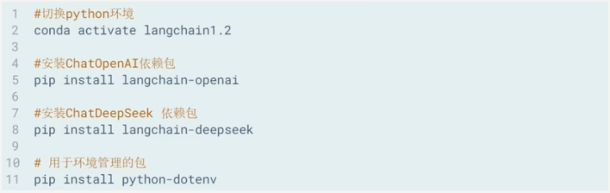
2. 在pycharm里注意要选择对应的解释器 (在右下角可以选择对应的解释器 一定一定不要选错 选成默认的canda环境！！！)
3. 常用的参数设置
   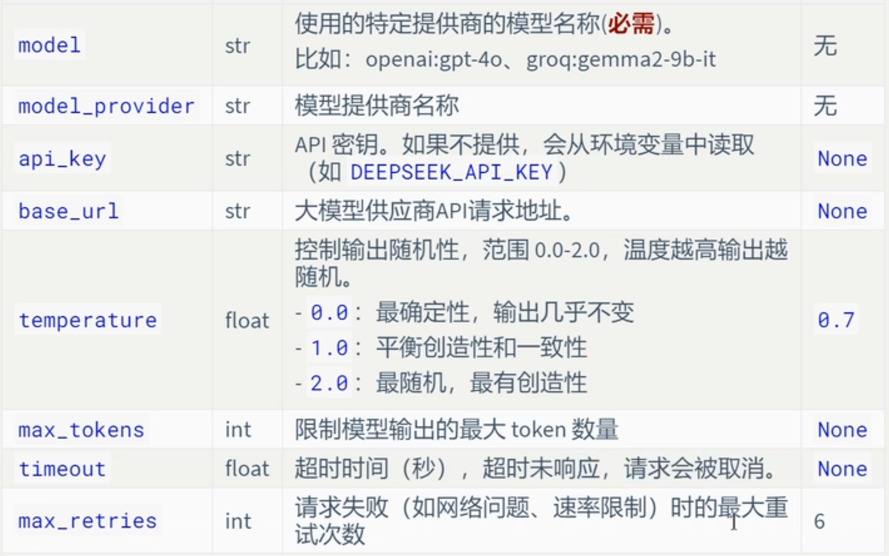


## 本地模型

------

✅ LangChain也支持使用ollama、vllm等框架启动的本地大模型。


## 模型调用

------

invoke()

✅ invoke方法非常灵活，支持三种形式的输入： 文本输入 、 字典列表 、 消息对象列表 （可以携带多轮对象，携带记忆）。 

✅ invoke的返回值

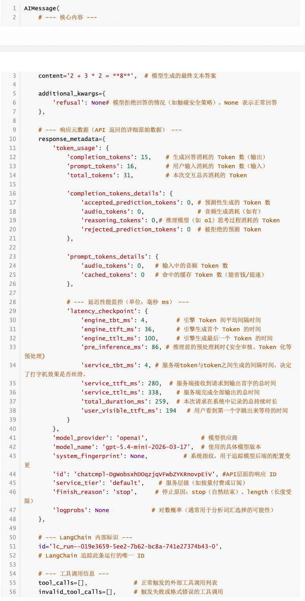

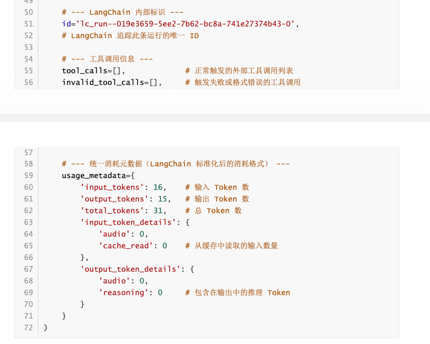


stream()

✅ 相应速度快

✅ 交互更流畅


batch()

✅ 一次性接收所有的请求


同步和异步调用


## 模型初始化完整参数

------


以deepseek为例：


入参：

```python
from langchain_deepseek import ChatDeepSeek
print(ChatDeepSeek.model_fields.keys())
```

出参：

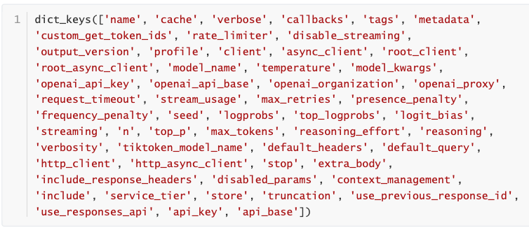

🚀 比较重要的:model_kwargs , extra_body


## 动态参数

------

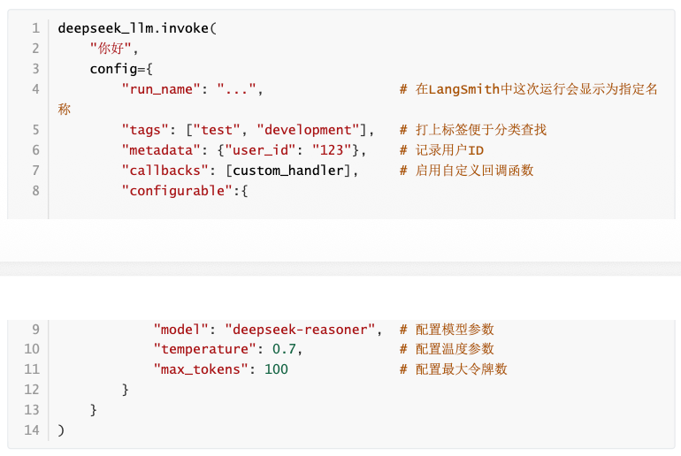

| 配置项          | 类型                      | 描述                                                         |
| --------------- | ------------------------- | ------------------------------------------------------------ |
| run_name        | str                       | 为当前运行设置一个可读的名称。如在 LangSmith 追踪系统中快速定位和识别不同的运行任务。 |
| tags            | List[str]                 | 为运行设置标签，用于分类和过滤。如在 LangSmith 追踪系统中快速定位和识别不同的运行任务。 |
| callbacks       | List[BaseCallbackHandler] | 设置回调处理器，在运行的不同阶段（开始、流输出、结束等）触发。与一些监控平台（如 LangSmith）集成进行深度追踪和调试。 |
| metadata        | Dict[str, Any]            | 附加任意的键值对元数据。记录本次调用的业务上下文，如 {"user_id": "123", "session_id": "abc"} |
| max_concurrency | int                       | 限制当前可运行对象的最大并发运行数。防止对 API 接口或本地资源造成过大压力，实现简单的速率限制。 |
| recursion_limit | int                       | 限制运行时递归调用的最大深度。主要在复杂的工作流（如 Agent 执行多步工具调用）中，防止出现无限递归循环。 |
| configurable    | Dict[str, Any]            | 一个万能字典，用于传递其他可配置参数。实现更高级的动态行为，如配置可替代的模型或组件。 |

# LangSmith

------

✅ LangSmith是Langchain生态中专门用于LLM应用调试、监控、评估和管理的平台。


# 消息和提示词模板

------

✅ **Message（消息）是模型交互的最基本单元**

LangChain 在 1.0 中提供了跨模型统一的 Message 标准。无论你使用的是 OpenAI、Anthropic、Gemini 还是本地模型，这一标准都能保持一致的行为。好处：

- 兼容性强 ：不同模型的消息格式自动对齐。
- 可扩展性高 ：方便添加多模态内容或自定义字段。
- 可追踪性好 ：为 LangSmith 等调试工具提供一致的上下文数据结构。


## 认识消息

------

### 消息的内部结构

------

✅ LangChain的消息（Message）对象包含三种字段

- Role：消息所属的角色或类型，如 system、 user 、 assistant 。
- Content：消息内容
- Metadata：（可选）元数据，存储额外信息。如：消息ID、响应时间、token消耗量、消息标签

等


### 消息的类型

------

✅ LangChain定义了很多消息类型，通过 role 区分。常用的有四种。

```json
{"role": "system","content": "你是个精通编程的软件架构师"}
{"role": "user","content": "你好啊~"}
{"role": "assistant","content": "我也很高兴认识你"}
{"role": "tool","content": "今天天气很好","tool_call_id":"call_00_nUD2NC9QRN5Cg1GaoIkBJQ4s"}
```


### 消息格式

------

1. JSON格式
2. 对象格式 


# 工具调用

------

## 概述

------

✅ 在LangChain中，工具（Tools）实际上是指明确定义了输入和输出的 可调用函数 。因此， 工具调用(Tool Calling) 也被称为 函数调用(Function Calling)。

✅ 整体流程入下

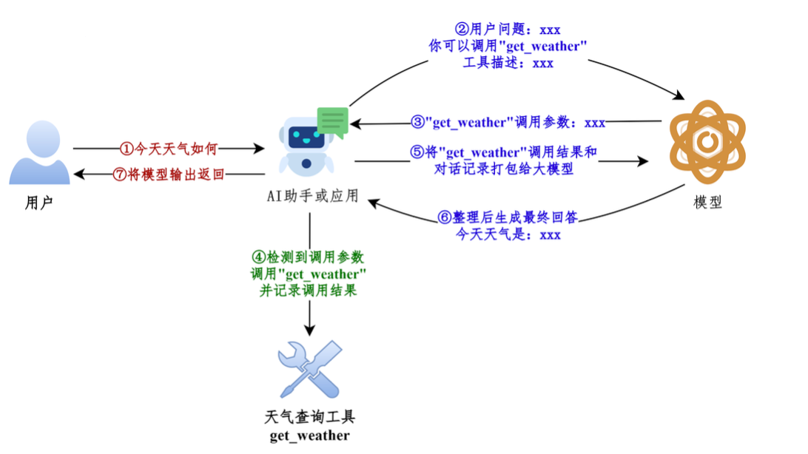

✅ 细节流程如下

步骤1：模型绑定工具 ：通过model.bind_tools([...])绑定一个或者多个工具。

步骤2：模型生成工具调用请求 ：用户输入问题，调用模型（比如invoke()）。如果需要调用工具，模型返回包含工具调用信息（如工具名称和参数）的AIMessage。

步骤3：开发者手动执行工具 ：用户从响应中提取工具调用信息并手动调用对应的工具（比如工具.invoke()）。

步骤4：将工具执行结果ToolMessage传递给模型生成最终结果 ：将之前用户提问内容和手动执行工具结果ToolMessage返回模型，模型最终生成回复。


## 工具的定义

------


### 不使用@tool（不推荐）

------

```python
from langchain_core.utils.function_calling import convert_to_openai_tool
from rich import print as rprint
def get_weather(dt: str, city: str="北京"):
    """
    天气查询工具
    Args:
        dt: 日期
        city: 城市名称
    """
    return f"{city}天气晴朗"
rprint(convert_to_openai_tool(get_weather))
```


### 使用@tool（推荐）

------

```python
class weatherSchema(BaseModel):
    city: str = Field(default="北京", description="城市名称")
    if_forecast: bool = Field(default=False, description="是否包含明天天气预报")
    
@tool("get_weather_and_forecast", description="查询当天天气，可以包含明天天气", args_schema=weatherSchema)
def get_weather(city: str, if_forecast: bool):
    res = f"{city}今天天气不错"
    if if_forecast:
        res += "\n明天天气也不错"
    return res
```


# 结构化输出

------

## 概述

------


### 什么是结构化输出

------

✅ 要求模型最终返回一个符合预定义结构的数据对象，例如固定字段的JSON、Pydantic 模型、TypedDict，而不再是无格式的自然语言文本。它的核心目标是把“ 自然语言回答”变成“ 程序可以稳定消费的数据”


### 结构化输出

------

```python
# 一步到位
structured_llm = model.with_structured_output(Person)
person = structured_llm.invoke("张三是一名 30 岁的软件工程师")
# ✅ 自动解析、验证、创建对象
```


### 结构化输出模式

------

目前LangChain 1.x 支持多种Schema与结构化输出方式：

- Pydantic（字段校验、描述、嵌套结构，功能最丰富）
- TypedDict（轻量类型约束）
- JSON Schema（与前后端/跨语言接口最通用）
- dataclass

模型对象可以调用 with_structured_output() 绑定输出模式（schema）。


## 四种结构化输出

------

### Pydantic

------

✅ 它通过在运行时强制执行类型提示，确保数据的正确性和一致性，是 生产场景首选 。

✅  需要满足的几个要素：

- 所有结构化输出的数据模型都必须继承 BaseModel
- 使用 类型提示 。Pydantic 支持丰富的字段类型：str 、int、float、List[xxx]、Optional[xxx]等
- 使用 Field() 添加字段默认值和描述，帮助 LLM 理解字段含义


基本使用

```python
from pydantic import BaseModel, Field, SecretStr

class MovieModel(BaseModel):
    """
    电影的详细信息
    """
    title: str = Field(description="电影标题")
    year: int = Field(description="电影上映年份")
    director: str = Field(description="导演")
    rating: float = Field(description="电影评分，满分十分")
    
model_with_structure = model.with_structured_output(MovieModel)
response = model_with_structure.invoke("给出盗梦空间的信息")
print(response)
print(type(response))
```


详细过程

<details class="lake-collapse"><summary id="u63ca038b"><span class="ne-text" style="color: rgba(255,0,255,1)">图解和文字</span></summary><p id="u3fbedd36" class="ne-p" style="margin: 0; padding: 0; min-height: 24px"></p><p id="u447abd34" class="ne-p" style="margin: 0; padding: 0; min-height: 24px"><span class="ne-text" style="color: rgba(255,0,0,1)">第1步：定义结构</span><span class="ne-text" style="color: #262626"><br></span><span class="ne-text" style="color: #262626">比如：</span></p><pre data-language="python" id="PH9BW" class="ne-codeblock language-python" style="border: 1px solid #e8e8e8; border-radius: 2px; background: #f9f9f9; padding: 16px; font-size: 13px; color: #595959"><code>from pydanticimportBaseModel, Field

class BookInfo(BaseModel):
    title: str = Field(description="书名")
    author: str = Field(description="作者名字")
    tags: list[str] = Field(description="书籍的标签或分类")</code></pre><p id="ub450fb77" class="ne-p" style="margin: 0; padding: 0; min-height: 24px"></p><p id="u16ec2b97" class="ne-p" style="margin: 0; padding: 0; min-height: 24px"><span class="ne-text" style="color: rgba(255,0,0,1)">第2步：协议转换</span></p><p id="ub0ba4804" class="ne-p" style="margin: 0; padding: 0; min-height: 24px; text-indent: 2em"><span class="ne-text" style="color: #262626">LangChain 内部会调用 Pydantic 的底层方法（如 </span><span class="ne-text" style="color: #0000ff">model_json_schema() </span><span class="ne-text" style="color: #262626">），将你写的 Python 代码自动转换成标准的 JSON Schema。这个 JSON Schema 是一段严格的 JSON 文本，详细描述了有哪些字段、字段类型是什么（ </span><span class="ne-text" style="color: #0000ff">string </span><span class="ne-text" style="color: #262626">,</span></p><p id="u6e184a97" class="ne-p" style="margin: 0; padding: 0; min-height: 24px"><span class="ne-text" style="color: #0000ff">array</span><span class="ne-text" style="color: #262626"> 等）以及字段的描述（ </span><span class="ne-text" style="color: #0000ff">description </span><span class="ne-text" style="color: #262626">）。</span></p><p id="ua4fc41de" class="ne-p" style="margin: 0; padding: 0; min-height: 24px"><span class="ne-text" style="color: #262626"></span></p><p id="u347213ca" class="ne-p" style="margin: 0; padding: 0; min-height: 24px"><span class="ne-text" style="color: rgba(255,0,0,1)">第3步：模型交互与强约束</span></p><p id="ua45e49ce" class="ne-p" style="margin: 0; padding: 0; min-height: 24px; text-indent: 2em"><span class="ne-text" style="color: #262626">LangChain 会将这个 JSON Schema 包装进给大模型的 API 请求中。现代方法（ </span><span class="ne-text" style="color: #0000ff">.with_structured_output </span><span class="ne-text" style="color: #262626">）： 现代大模型（如 OpenAI、Anthropic、Gemini 等）普遍支持“函数调用/工具调用（Function/Tool Calling）”或“JSON Mode”。LangChain 会把 JSONSchema 作为 Tools 传入。大模型侧的约束： 像 OpenAI 的 </span><span class="ne-text" style="color: #0000ff">strict=True</span><span class="ne-text" style="color: #262626"> 参数，会启动模型的语法采样约束（Grammar-based sampling）。大模型在解码生成 token 时，不是瞎猜，而是严格按照 JSON Schema 的语</span></p><p id="u9213d1fa" class="ne-p" style="margin: 0; padding: 0; min-height: 24px"><span class="ne-text" style="color: #262626">法树进行选择，从而在模型底层级保证了输出格式绝不走样。</span></p><p id="ua889d2ef" class="ne-p" style="margin: 0; padding: 0; min-height: 24px"><span class="ne-text" style="color: #262626"></span></p><p id="u48d78791" class="ne-p" style="margin: 0; padding: 0; min-height: 24px"><span class="ne-text" style="color: rgba(255,0,0,1)">第4步：自动解析与验证</span></p><p id="ue0dde211" class="ne-p" style="margin: 0; padding: 0; min-height: 24px"><span class="ne-text" style="color: #262626">当大模型返回符合 JSON 规范的字符串后，LangChain 的 </span><span class="ne-text" style="color: #0000ff">PydanticStructuredOutputParser </span><span class="ne-text" style="color: #262626">（解析器）会接管工作：</span></p><p id="uc3eeca9c" class="ne-p" style="margin: 0; padding: 0; min-height: 24px"><span class="ne-text" style="color: #262626">1. 解析（Parsing）： 将字符串解析为 Python 字典。</span></p><p id="ud6fb734c" class="ne-p" style="margin: 0; padding: 0; min-height: 24px"><span class="ne-text" style="color: #262626">2. 验证（Validation）： 将字典喂给你的 Pydantic 模型。Pydantic 会自动检查数据类型是否正确。如果模型漏掉了必填字段，或者类型错误，这里会直接抛出验证错误（或者触发 LangChain 的重试机制）。</span></p><p id="u3805a6ea" class="ne-p" style="margin: 0; padding: 0; min-height: 24px"><span class="ne-text" style="color: #262626">3. 返回（Return）： 如果通过验证，你拿到的不再是冷冰冰的字符串，而是一个直接可以点出属性的 Python Pydantic 对象（例如 </span><span class="ne-text" style="color: #0000ff">result.title </span><span class="ne-text" style="color: #262626">）。</span></p><p id="u343da1ad" class="ne-p" style="margin: 0; padding: 0; min-height: 24px"></p></details>


### TypedDict

------

✅ TypedDict 是 Python 3.8+ 引入的一种类型提示工具，即带有类型声明的字典结构。适合需要快速定义字典结构且无需 Pydantic 重量级功能的场景。


基本使用

```python
from typing import TypedDict, List, Annotated

# 使用TypedDict定义嵌套结构
class Actor(TypedDict):
    """演员情况"""
    name: Annotated[str,"演员姓名"]
    role: Annotated[str,"饰演的角色"]
    
    
class Movie(TypedDict):
    """电影情况"""
    title: Annotated[str,"电影标题"]
    year: Annotated[int,"上映年份"]
    director: Annotated[str,"导演"]
    cast: Annotated[List[Actor],"演员列表"] # 嵌套列表定义
    rating: Annotated[float,"评分"]
    
# 设置模型结构化输出
structured_llm = model_with_closeai.with_structured_output(Movie)
# 调用模型并获取结构化输出
resp = structured_llm.invoke("给我介绍下电影《盗梦空间》")
# 访问嵌套数据
print(f"电影名: {resp['title']}")
print(f"上映年份: {resp['year']}")
print(f"导演: {resp['director']}")
print(f"演员列表:{resp['cast']}")
print(f"评分: {resp['rating']}")
```


### JSON Schema

------

✅ 这种方式需要按照JSON Schema规范拼接JSON字符串，比较繁琐，并且缺少校验机制。不推荐。


基本使用

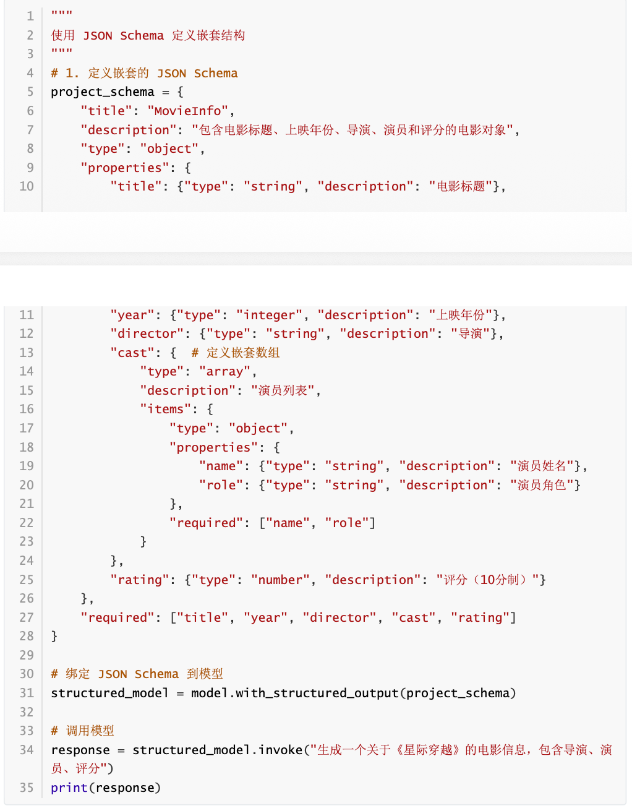


### @dataclass

✅ @dataclass是 Python 标准库 dataclasses 提供的类装饰器，用于简化“以字段为核心”的数据类定义。给类加上 @dataclass 后，Python 会根据字段声明自动生成常用方法，例如：

- __init__
- __repr__
- __eq__

因此，从对象行为上看， @dataclass 创建的类，常常 近似于 手写这些方法的普通类。


基本使用

```python
from pydantic import Field

@dataclass
class Movie():
    """
    电影的详细信息
    """
    title: str = Field(description="电影标题")
    year: int = Field(description="电影上映年份")
    director: str = Field(description="导演")
    rating: float = Field(description="电影评分，满分十分")
    
structured_model = model.with_structured_output(Movie)
response = structured_model.invoke("给出盗梦空间的信息")
print(response)
print(type(response))
```


### 重点小结

------

✅ 用Pydantic定义schema，在接收到响应后会进行校验，字段不匹配则抛出异常，其余三种方式不校验。

这里只展示Pydantic如下：

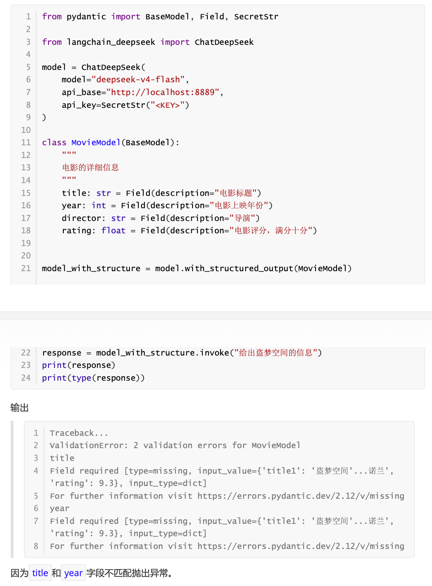


## 获取结构化结果方式

------

### 使用with_structured_output

------

代码如下

```python
class Movie(BaseModel):
    """电影信息"""
    title: str = Field(description="电影标题")
    year: int = Field(description="上映年份")
    director: str = Field(description="导演")
    rating: float = Field(description="评分（10分制）")
    
# 设置模型结构化输出
model_with_structure = model.with_structured_output(Movie,include_raw=True)
```


### 使用输出解析器(不推荐)

------

✅ 这种方法更传统，依赖于在提示词中明确指示模型输出特定格式的文本，然后使用解析器进行转换。其流程是： 提示词指导 (引导生成指定类型）→模型生成文本→解析器转换 。

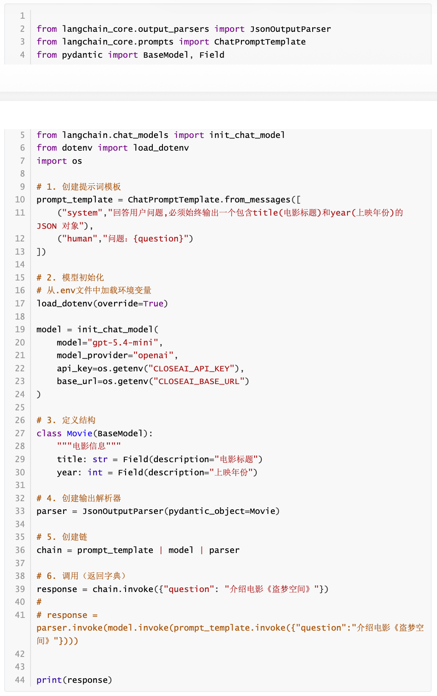


# 智能体

------

## 理解 Agents

------

### 概述

------

✅ 在大模型应用开发中，智能体通常指一种以 大语言模型为推理与决策核心 ，结合 记忆 、 工具调用 与环境交互能力，能够进行 规划决策 并执行 复杂任务 以达成目标的软件系统。

✅ 核心组件：

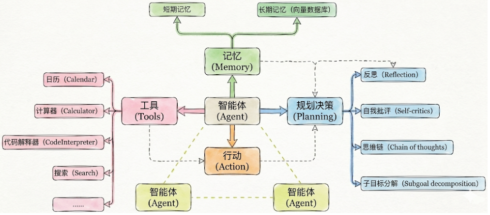

实际开发中几个要素并不需要同时出现，一句话总结

- 必须的：行动（Action）
- 几乎总是存在的：工具（Tool）
- 有条件存在的：规划决策（Planning）
- 最容易被省略的：记忆（Memory）


### agent 的创建与调用

------

历史上的调用：

在 LangChain 0.x 时代，框架内的 Agent 系统经历了“碎片化”阶段。当时的设计理念是 “针对场景设计特定 Agent”：

- 如果你要实现思维链推理（ReAct），就用 create_react_agent ；
- 如果需要结构化输出，就用 create_structured_chat_agent ；
- 要工具调用，则用 create_tool_calling_agent。

```python
# 3. 创建 agent
agent = create_react_agent(
    llm=model,
    tools=tools,
    prompt=prompt
)

# 4. 创建 executor
executor = AgentExecutor(
    agent=agent,
    tools=tools,
    verbose=True
)

# 5. 调用
result = executor.invoke({"input": "问题"})
```

⚠️  这种方式灵活，但也带来了三个明显问题：

1. 心智负担高——每种 Agent 都要单独记忆 API 与参数；
2. 可组合性差——多个 Agent 之间无法统一调度；
3. 生态碎片化——不同模块难以复用或协同演化。


全新的调用：

✅ 统一为一个入口：create_agent()

```python
# 2. 创建 agent（一步完成）
agent = create_agent(
    model=model,
    tools=[tool1, tool2],
    system_prompt="Agent 的行为指令" # 可选
)
```


### 模型的传入方式

------

✅ 分为字符串和对象 比较简单 可以看代码


### 绑定工具

------

✅ 支持静态和动态绑定，后者需要中间件


Langchain 内置的工具如下

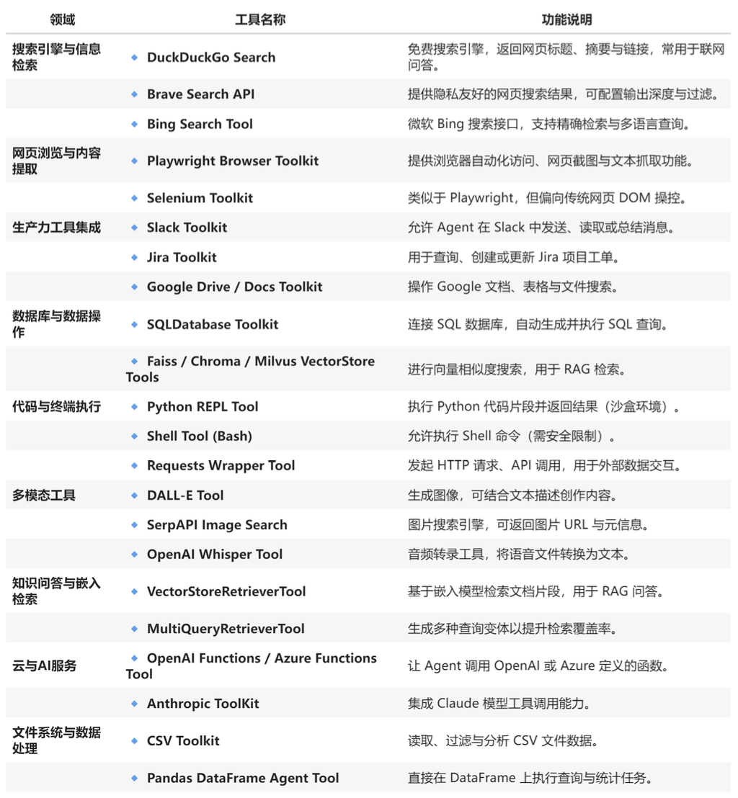